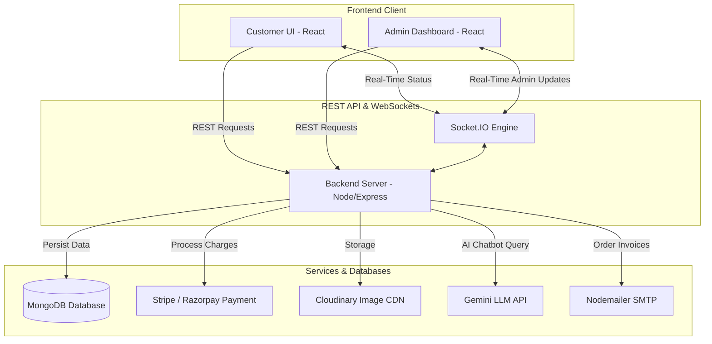

# 🚚 QuickBite - Food Delivery Application (MERN Stack)

[](https://opensource.org/licenses/MIT)
[](https://github.com/Shoaib05504/Quick-Bite/actions/workflows/security.yml)
[](https://nodejs.org/)
[](https://www.mongodb.com/)
[](https://github.com/gitleaks/gitleaks)

**QuickBite** is a full-featured, modern food ordering and delivery web application built using the MERN stack (MongoDB, Express, React, Node.js). The application consists of three components:
1. **Frontend App**: Interactive user experience to browse the menu, add food items to cart, complete payments securely, track live orders, chat with our AI assistant, and split bills.
2. **Admin Dashboard**: Visual panels for managing inventory, category additions, updating order statuses, and viewing platform statistics.
3. **Backend Server**: Centralized REST API server powering transactions, authentications, real-time Socket.IO notifications, and databases.

---

## 🗺️ System Architecture



---

## ✨ Features

- **🛍️ Complete Shopping Cart**: Streamlined food exploration, customizable carts, and multi-category filters.
- **💳 Secure Payment Integrations**: Credit card processing using **Stripe** and online payments via **Razorpay**.
- **💬 AI Chatbot Support**: Natural conversations with the AI bot powered by Google's **Gemini-2.5-Flash** API.
- **⚡ Real-Time Tracking**: Instantaneous order progress updates using **Socket.IO** connections.
- **👥 Group Orders & Smart Split Bills**: Collaborate with friends on group selections and easily partition bills.
- **📧 Automated Invoice Emails**: High-quality HTML receipt emails delivered automatically upon successful payment.
- **📊 Admin Portal**: CRUD menu actions, live status dispatchers, and order logs.

---

## 🔒 Security Setup & Checks

To protect user credentials and platform integrity, we have configured a comprehensive security architecture.

### 1. Repository Realignment
If your local directory was initialized in your user home directory (`C:\Users\user`), Git may track personal files. Align your local project repository immediately by running:

```powershell
# 1. Initialize Git in the project root
git init

# 2. Add your GitHub remote
git remote add origin https://github.com/Shoaib05504/Quick-Bite

# 3. Create your first commit safely
git add .
git commit -m "chore: initial repository alignment and security configurations"
git branch -M main

# 4. Push to GitHub
git push -u origin main
```

### 2. Secret Protection & GitIgnore Configuration
Environment configuration files (`.env`) containing critical keys must **NEVER** be committed to GitHub. We have configured:
- Root and subdirectory `.gitignore` files to block all environment variables (`.env*`), temporary files, node modules, and builds.
- A master `.env.example` file to serve as a secure template for local configurations.

### 3. Automated GitHub Security Workflows
The project includes a pre-push/PR workflow in `.github/workflows/security.yml` that executes on GitHub Actions:
- **Gitleaks Scan**: Scans all commit histories for leaked credentials or high-risk strings.
- **Dependency Audit**: Runs high-priority vulnerability tests (`npm audit`) for all node packages.

---

## 🚀 Running Locally — Step-by-Step

### Prerequisites
- **Node.js** (v20+ recommended)
- **MongoDB** (Atlas or local instance)

### 📦 Installation

#### 1. Setup Backend
Navigate to the backend directory, install dependencies, and configure environment variables:
```bash
cd backend
npm install
```
Create a `.env` file based on the template:
```env
PORT=8000
MONGO_URI="your_mongodb_connection_string"
JWT_SECRET="generate_a_random_jwt_secret"
STRIPE_SECRET_KEY="your_stripe_secret_key"
RAZORPAY_KEY_ID="your_razorpay_key_id"
RAZORPAY_KEY_SECRET="your_razorpay_secret"
CLOUDINARY_CLOUD_NAME="your_cloudinary_name"
CLOUDINARY_API_KEY="your_cloudinary_key"
CLOUDINARY_API_SECRET="your_cloudinary_secret"
EMAIL="your_email@gmail.com"
EMAIL_PASSWORD="your_gmail_app_password"
GEMINI_API_KEY="your_gemini_api_key"
FRONTEND_URL="http://localhost:5173"
ADMIN_URL="http://localhost:5174"
```
Start the API server:
```bash
npm run server
```

#### 2. Setup Frontend Client
```bash
cd ../frontend
npm install
```
Create a `.env` file containing:
```env
VITE_API_URL="http://localhost:8000"
VITE_APP_NAME="QuickBite"
```
Start the frontend dev server:
```bash
npm run dev
```

#### 3. Setup Admin Dashboard
```bash
cd ../admin
npm install
```
Create a `.env` file containing:
```env
VITE_API_URL="http://localhost:8000"
```
Start the dashboard:
```bash
npm run dev
```

---

## 🛠️ Tech Stack & Dependencies

- **Frontend**: React, React Context API, React Router, Socket.io Client, CSS3
- **Backend**: Node.js, Express.js, MongoDB + Mongoose, JWT authentication
- **Payment Processing**: Stripe API, Razorpay SDK
- **AI Integrations**: Gemini API (via Node SDK)
- **Communications**: Nodemailer SMTP
- **Assets Hosting**: Cloudinary CDN

---

## 🛡️ Vulnerability Disclosure
For reporting security issues or vulnerabilities, please review our [Security Policy (SECURITY.md)](./SECURITY.md). Do not file issues for credentials leaks.

## 🤝 Contributing
Feel free to fork the repository, make changes, and open a Pull Request. Ensure that security checks pass locally and no credential variables are altered.
